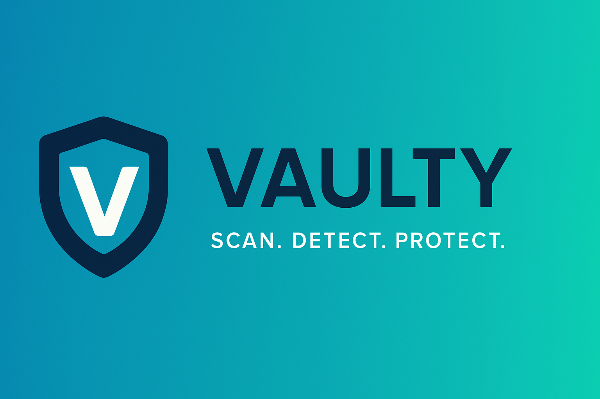

  
   

  <h2 style="margin-bottom: 10px;">🔒 Vaulty: Scan • Detect • Protect</h2>
 

This project was created as part of the <strong>APTC 495 – Applied Technology Capstone</strong> course at the <strong>University of Maryland Global Campus (UMGC)</strong>.
It represents the culmination of our degree program, integrating cybersecurity, software development, and applied technology into a functional solution.
<strong>Vaulty</strong> showcases a beginner-friendly Data Loss Prevention (DLP) scanner that detects sensitive information in local files using deterministic pattern rules and security-first engineering practices.

  

    
    
    
    
    
  

## 👥 Team

- **Murray Milton** — Project Lead / Developer  
- **Johnny Irvin** — QA Engineer / Security Tester

---

## 🧠 Design

**Vaulty** is a lightweight, local-first DLP tool focused on **usability, transparency, and privacy-by-design**.

It helps users quickly scan **TXT / CSV / PDF** files for common sensitive patterns (emails, phone numbers, SSNs, credit cards), and produces **clear, auditable reports**. The entire scan runs locally — no cloud upload, no external API calls, no remote logging.

This project also enforces secure development discipline. We run tools like **Bandit**, **mypy**, **ruff**, **black**, and **radon** as part of the workflow and CI, so the codebase itself reflects secure coding, static analysis, type safety, and complexity control.

**Core workflow:**

1. **Upload** a file via the Streamlit UI  
2. **Extract** its text content using safe file readers (TXT, CSV, PDF via `pdfminer.six`)  
3. **Detect** sensitive patterns using conservative regex rules + validator checks (e.g. Luhn for credit cards)  
4. **Report** results in two forms:
   - a friendly summary that shows *types and counts* only (no raw PII in the UI),
   - a downloadable JSON file with structured findings, offsets, and a risk score for audit/review.

We do this to keep things explainable and ethical:
- Users get a privacy-safe on-screen summary.
- Security reviewers, auditors, and graders can still inspect the JSON report in depth.

---

## 🛠️ Built With

- **Python 3.11+**  
  

- **Streamlit** (UI layer for non-technical users)  
  

- **Regex + validators + pdfminer.six** (detection + extraction)  
  
  

  - Regex patterns find candidates (high recall).  
  - Validators (like Luhn checksum) reduce false positives (higher precision).  
  - `pdfminer.six` extracts text from PDFs without executing any embedded content.

- **Bandit / mypy / ruff / black / radon / pytest** (secure SDLC pipeline)  
  

  - **Bandit**: flags insecure code patterns  
  - **mypy**: static typing checks  
  - **ruff + black**: style and formatting consistency  
  - **radon**: enforces low cyclomatic complexity per function  
  - **pytest + coverage**: repeatable, measurable testing

---

## 🧩 Capabilities

- **Scan local files**  
  - `.txt`, `.csv`, `.pdf` (extensible later)

- **Pattern detection**  
  - Emails  
  - U.S. Social Security Numbers  
  - Phone numbers  
  - Credit cards (validated with Luhn, to reduce false positives)

- **Report outputs**  
  - Provides a summary: detector types and counts  
  - JSON export: structured `Finding` objects with:
    - detector name  
    - exact match string  
    - character offsets (`start`, `end`)  
    - deterministic `risk_score`  
    - `why` (short explanation of how the score was calculated)

- **Security posture**  
  - Local-only scanning  
  - No raw PII written to logs or shown in the on-screen summary  
  - Temporary files from uploads are cleaned up immediately after scanning  
  - Files larger than a set limit (10 MB by default) are rejected to reduce abuse / accidental overload

- **Developer safety**  
  - Bandit runs in CI and pre-commit  
  - mypy, ruff, black, radon, pytest all enforced through `make` and GitHub Actions

---

## 🏗️ Architecture (Concept)

Vaulty is intentionally modular and easy to reason about:

 
